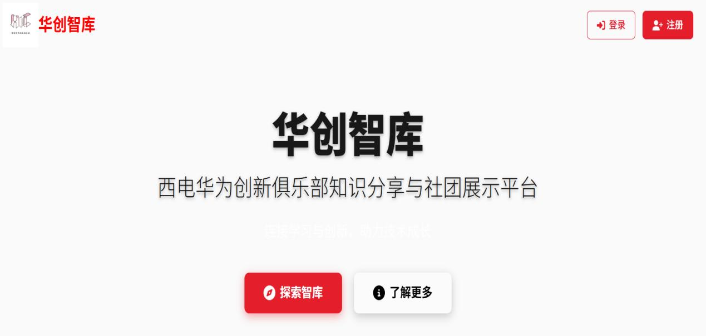
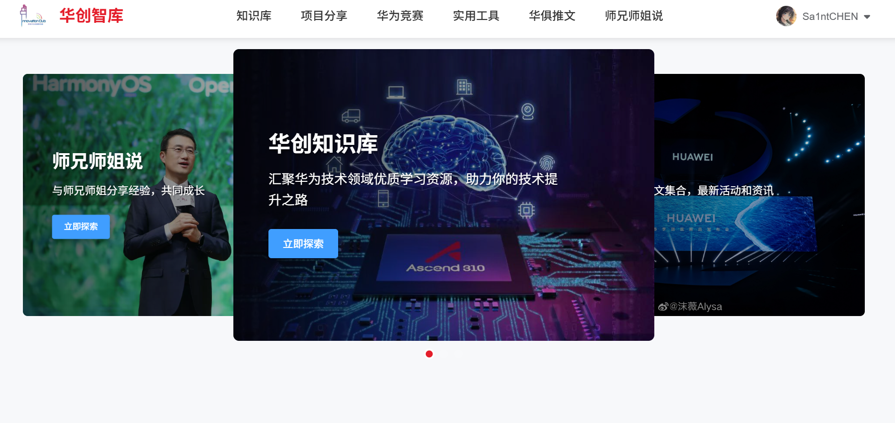
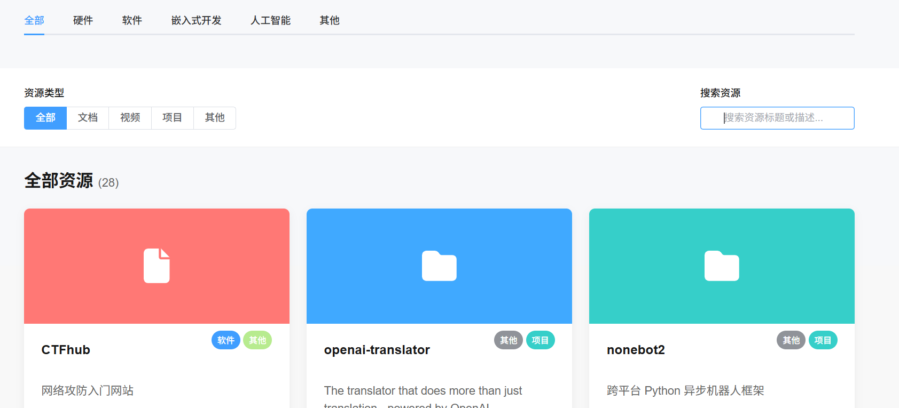
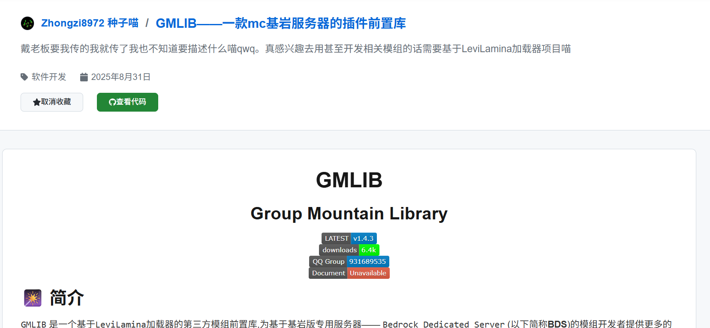

# 🎓 华创智库 - 西电华为创新俱乐部知识分享平台

**域名**：xduhic.top，支持响应式布局，手机/PC均可访问

</img>

## *上传代码仅供后续更新以及成员学习使用，请勿用于非法用途！*

## ⚙️ 项目配置

代码已抹除生产环境配置信息，若要在本地运行请自行连接数据库，补全`application.properties`配置，并确保前端JS代码中前端端口、后端API以及后端CORS配置正确。

**依赖项（Windows 10/11, macOS, Linux）：**
**后端环境**
- **Java**: JDK 17 +
- **Maven**: 3.6 +
- **MySQL**: 8.0 +
### 前端环境
- **Node.js**: 18.0+ 
- **包管理器**: npm, yarn 或 pnpm

**启动方法**:

``
# 安装依赖
cd UI
npm install
``
``
# 启动后端
cd Server
mvn clean install
mvn spring-boot:run
``
``
# 启动前端
cd UI
npm run dev
``
``
# 项目打包
cd Server
mvn clean package
cd UI
npm run build
``

## 📖 项目简介

华创智库是西电华为创新俱乐部自主设计、开发的知识分享平台，旨在为华创同学和西电同学提供项目分享、知识传播和学术研究的支持。同时，还可以通过网站了解西电华为创新俱乐部以及华为技术有限公司的相关动态。平台集成了知识库、项目分享、华为竞赛、实用工具、华俱推文和师兄师姐说六大核心板块，板块内容及功能会根据大家的需求不断更新，不仅能为同学们提供技术学习方面的指导，同时兼具舒适的使用体验。

## 🎯 功能模块

*登录/注册后解锁所有功能，根目录有快速导航，食用前可在portal页查询系统公告和社团动态，about页面了解西电华为创新俱乐部*

### 📚 知识库

涵盖华为技术领域各种学习资源，包括文档、视频、项目以及论坛等等 **（部分可能需要魔法）** 如果大家有相关需求可以在我们的QQ社群提出，我们会尽力满足大家~**多上智库！**

### 📊 项目分享

只要完成注册，就可以在平台上分享和收藏项目啦~给你的项目写好介绍文档和仓库地址，大家互相交流学习~同时，你可以在导航栏-个人中心-项目仓库里找到你发布的项目/收藏的项目反复修改/学习~希望大家踊跃上传~

### 🏆 华为竞赛

我们会推送最新的华为竞赛讯息，并且告知大家进行状态，大家可以自由去官方链接报名~日后可能会推出组队板块~

### 📅 实用工具

我们为大家提供了各种工具，提高大家的学习和办公效率~大多支持网站直接使用，有些需要大家手动下载 **（部分可能需要魔法）（有部分工具可能要收费，想白嫖的要自己去找，我们只是提供思路）** 同样，实用工具板块我们欢迎大家告知需求，我们会及时更新~

### 📢 华俱推文

我们会同步更新XDU华创公众号发布的最新文章，帮助大家在学习技术的同时快速了解到社团动态~所有人都可以在这里了解到华为创新俱乐部和华为技术有限公司的深厚底蕴~

### 👤 师兄师姐说

日后我们会邀请华创的优秀学长学姐发布学习/就业相关的上岸经验，指导大家的生涯规划~新生和毕业生都可以在这里打破信息差~

</img>

</img>

</img>

## 📞 联系我们

- 👤 项目负责人：[@SaintCEN](https://github.com/SaintCEN)
- 🌐 官网: www.xduhic.top
- 💬 华俱QQ社群：1053588377

## 🙏 致谢

感谢所有为这个项目做出贡献的开发者和用户！

---

⭐ 如果这个项目对您有帮助，请给我们一个星标！

